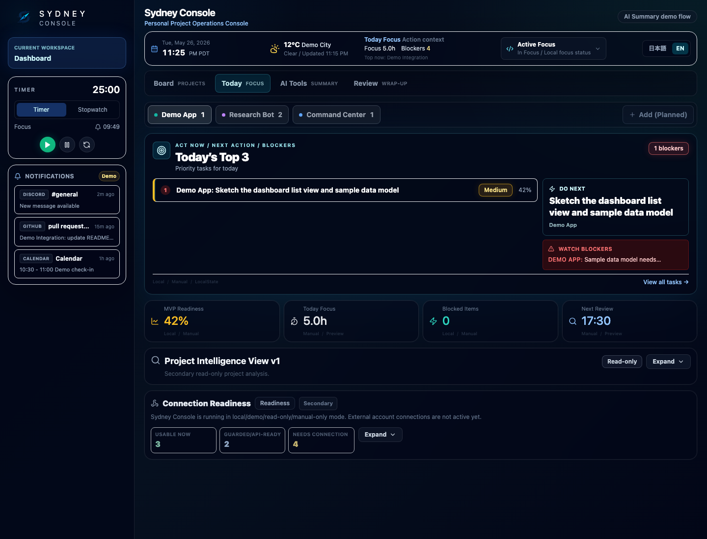
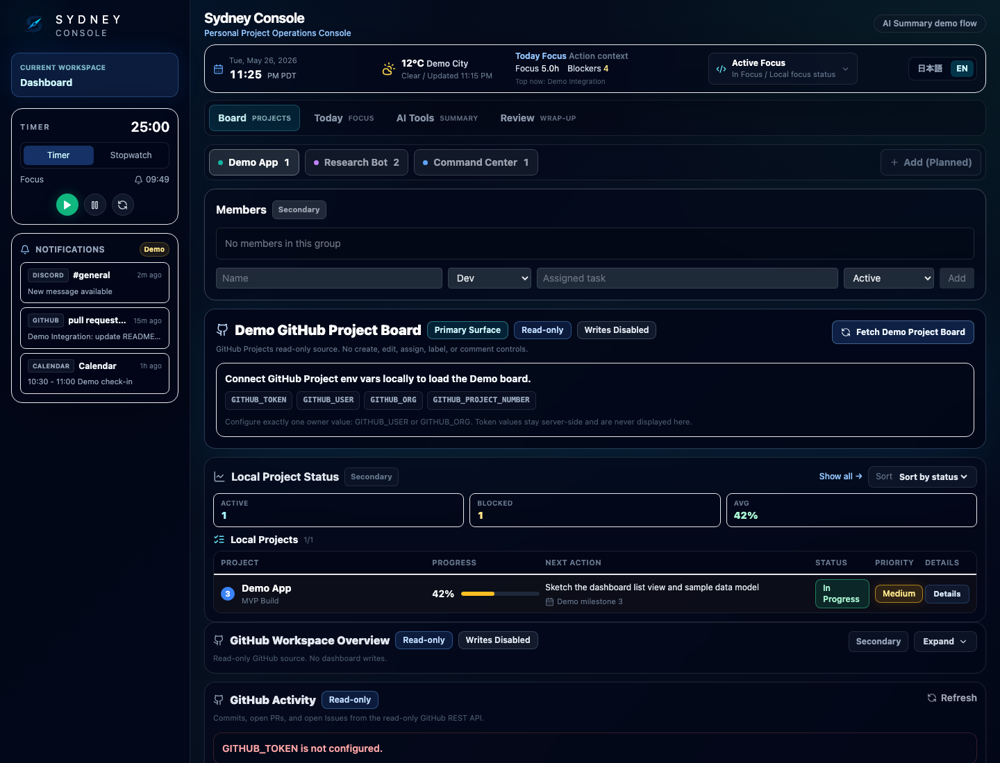
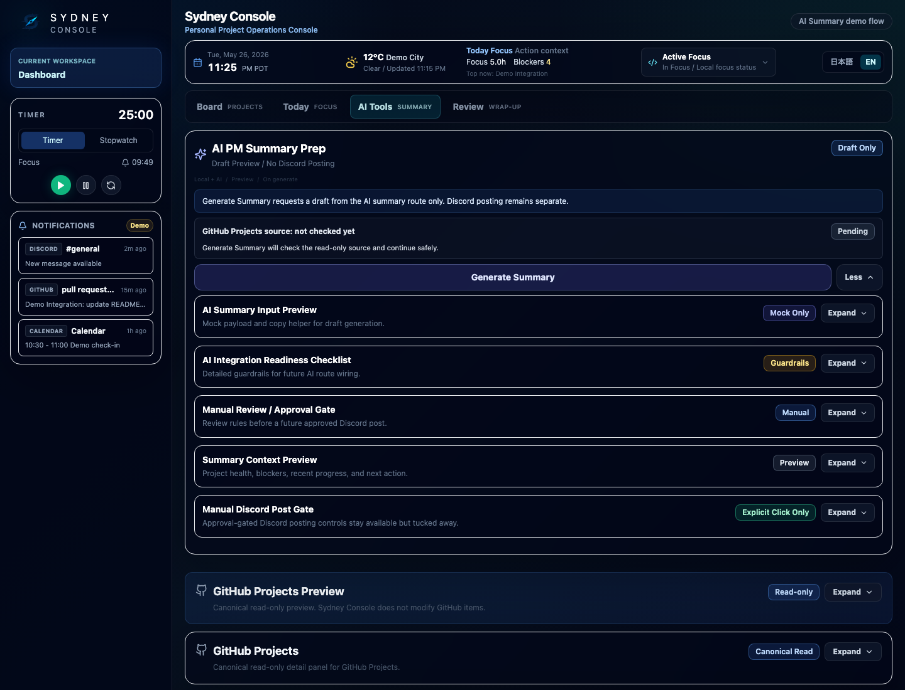

# Sydney Console — Personal Project Operations Console

Local-first. Self-hosted. Safety-gated. Not a SaaS.

Sydney Console is a local-first personal project operations console for deciding what to do next across active projects. It brings daily priorities, read-only project context, AI-assisted summaries, and manual review into one dashboard without turning integrations into automatic actions.

Sydney Console is the product surface for local-first project operations; AI-assisted summaries are optional workflow features, not autonomous actions.

## Screenshots

### Today Focus



### Board / GitHub Read-only



### AI Tools / Manual Approval Gate



## Why I Built This

Project context gets scattered across GitHub, local notes, AI summaries, and daily priority lists. That makes it easy to lose the next action, overstate progress, or publish an update before the context has been reviewed.

Sydney Console solves that with one safety-gated local console for focus, review, and read-only project visibility. The system helps turn project context into a PM-style draft, but the human stays responsible for reviewing, approving, and choosing any outbound action.

## What This Is

- A Personal Project Operations Console for daily project focus, local review, and safe status visibility.
- A local-first dashboard for deciding what to do now across Today, Board, AI Tools, and Review surfaces.
- A read-only GitHub Projects viewer for project board context, issues, and pull requests.
- A manual AI summary workspace where drafts are reviewed before any outbound action.
- A self-hosted template another technical user can clone, configure, and run locally.

## What Makes It Different

- Local-first and self-hosted by design.
- GitHub Projects and GitHub Activity are read-only context sources.
- AI summaries are drafts, not automatic decisions or actions.
- AI Summary Discord posting is approval-gated; Daily Summary and Test sends are explicit manual actions.
- Built as a personal project operations console, not a SaaS clone.

## What This Is Not

- Not a Monday.com clone.
- Not a SaaS.
- Not a multi-user platform.
- No GitHub write automation.
- No Discord auto-posting.

## Core Surfaces

- Header: local date/time, weather/status context, current focus, and study status.
- Today: the main action surface for Top 3 priorities, next action, blockers, and focus timer controls.
- Board: read-only project reality, including the primary Recipe GitHub Project Board and local project status.
- AI Tools: AI summary draft generation, preview, approval, and manual Discord gate.
- Review: local memo, review log, and end-of-day wrap-up state.

## Suggested Demo Flow

1. Start on Today to review top priorities, blockers, and the next action.
2. Open Board / GitHub read-only views to inspect project context.
3. Use AI Tools to generate a draft project summary.
4. Review the draft and use the manual approval gate.
5. Finish in Review with notes and wrap-up context.

## Quick Start

1. Clone the repository.
2. Install dependencies:

   ```bash
   npm install
   ```

3. Create local env values:

   ```bash
   cp .env.example .env.local
   ```

4. Fill in only the integrations you want to test.
5. Run and open the dashboard:

   ```bash
   npm run dev -- --hostname 127.0.0.1 --port 3001
   ```

   ```text
   http://127.0.0.1:3001/dashboard
   ```

## Environment Setup

Use `.env.example` as the source of truth for local environment variables. Copy it to `.env.local`, fill in only the integrations you want to test, and never commit real tokens, webhook URLs, or API keys.

Missing optional env vars should degrade safely into unavailable or configuration-needed states.

GitHub integrations are read-only from the app's perspective.

### GitHub Projects

- `GITHUB_TOKEN`
- `GITHUB_USER` or `GITHUB_ORG`
- `GITHUB_PROJECT_NUMBER`
- `GITHUB_PROJECT_NUMBERS` for optional comma-separated multi-project loading

Used by the Board / GitHub Projects surfaces. These variables allow read-only project metadata and item context to load; the app does not perform GitHub writes.

### GitHub Activity / Workspace

- `GITHUB_TOKEN`
- `GITHUB_REPO` for the GitHub Activity feed
- `GITHUB_OWNER` for workspace overview
- `GITHUB_REPOS` for workspace overview, as a comma-separated repo list

Used by recent commits, pull requests, issues, and multi-repo workspace context.

### Optional OpenAI

- `OPENAI_API_KEY` for AI Summary draft generation.
- `OPENAI_MODEL` for an optional model override.

AI output is draft-only and should be reviewed before any outbound action.

### Optional Discord

- `DISCORD_DASHBOARD_WEBHOOK_URL`

AI Summary Discord posting is approval-gated. Daily Summary and Test Discord sends are explicit manual actions. There is no automatic background Discord posting.

After changing `.env.local`, restart the local dev server.

## Safety Boundaries

- GitHub Projects is read-only.
- No GraphQL mutations.
- No GitHub issue/project write controls.
- GitHub data is context, not absolute truth.
- Missing, stale, or unavailable data should be shown clearly.
- AI Summary Discord posting is approval-gated.
- Daily Summary and Test Discord sends are explicit manual actions.
- No automatic background Discord posting.
- AI Summary is draft/manual approval only.
- AI output must not overclaim status, completion, blockers, delivery, or external system health.
- Outbound actions require explicit human approval.
- No secrets are shown in the UI.

## QA / Local Verification

Run:

```bash
npm run typecheck
npm run test:e2e
git diff --check
```

Playwright smoke tests verify:

- `/dashboard` loads.
- Today / Board / AI Tools / Review surfaces are visible.
- AI/Discord surfaces remain manual/draft oriented.

For interactive Playwright debugging:

```bash
npm run test:e2e:ui
```

## Known Tradeoffs

- Local-first / self-hosted by design.
- LocalStorage persistence for local project and review state.
- No auth / no multi-user mode.
- `AresCommandCenter.tsx` is currently monolithic and planned for future component extraction.
- Smoke tests only.
- Chromium-only Playwright baseline.
- GitHub Actions not enabled yet.
- Weather, market, and calendar-style widgets may be demo/static depending on configuration.
- `npm audit` may report Next.js/PostCSS advisories in the current Next 14 dependency tree. This repository is published as a local-first portfolio/demo project, not as a hosted production service; a future maintenance branch can evaluate a Next 16 upgrade separately.

## Tech Stack

- Next.js: local dashboard app shell and server routes.
- TypeScript: typed frontend and API code.
- Tailwind CSS: dashboard styling.
- GitHub Projects v2 GraphQL read-only: project board context without writes.
- Playwright: local smoke-test foundation.
- Optional OpenAI / Discord integration: AI draft generation and manual approved posting.

## Release Checkpoints

- Current public package version: `1.2.1`
- `v1.0.0-personal-command-center`
- `v1.2.0-public-setup-foundation`
- `v1.2.1-public-qa-foundation`
